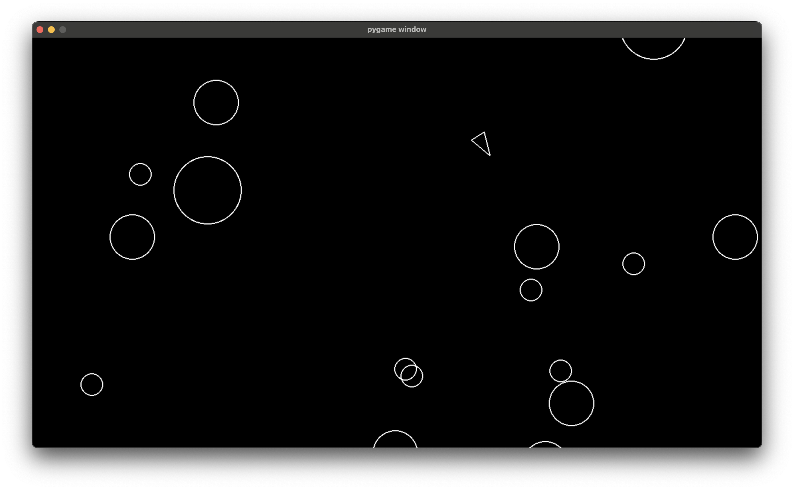

<div align="center">


# Asteroids

A classic space shooter game recreated in Python using Pygame.

[View Demo](#usage) · [Report Bug](https://github.com/username/asteroids/issues) · [Request Feature](https://github.com/username/asteroids/issues)

</div>

<!-- TABLE OF CONTENTS -->
<details>
  <summary>Table of Contents</summary>
  <ol>
    <li>
      <a href="#about-the-project">About The Project</a>
      <ul>
        <li><a href="#built-with">Built With</a></li>
      </ul>
    </li>
    <li>
      <a href="#getting-started">Getting Started</a>
      <ul>
        <li><a href="#prerequisites">Prerequisites</a></li>
        <li><a href="#installation">Installation</a></li>
      </ul>
    </li>
    <li><a href="#usage">Usage</a></li>
    <li><a href="#roadmap">Roadmap</a></li>
    <li><a href="#contributing">Contributing</a></li>
    <li><a href="#license">License</a></li>
    <li><a href="#contact">Contact</a></li>
  </ol>
</details>

<!-- ABOUT THE PROJECT -->
## About The Project

This is a faithful recreation of the classic Asteroids arcade game built in Python. Navigate through space, destroy asteroids, and survive as long as possible in this retro-style space shooter.

Here's what makes this game special:

* Classic asteroids gameplay mechanics with modern Python implementation
* Smooth player ship controls for precise navigation
* Accurate asteroid collision detection system
* Responsive shooting mechanics
* Runs at 1280x720 resolution for crisp graphics

This project demonstrates object-oriented programming principles in Python while recreating one of the most beloved arcade games of all time.

<p align="right">(<a href="#readme-top">back to top</a>)</p>

### Built With

This section lists the major frameworks/libraries used to build this project:

* [![Python][Python-badge]][Python-url]
* [![Pygame][Pygame-badge]][Pygame-url]

<p align="right">(<a href="#readme-top">back to top</a>)</p>

<!-- GETTING STARTED -->
## Getting Started

To get a local copy up and running follow these simple steps.

### Prerequisites

Make sure you have Python installed on your system:

* Python 3.7 or higher
* pip (Python package installer)

### Installation

1. Clone the repo

   ```sh
   git clone https://github.com/username/asteroids.git
   ```

2. Navigate to the project directory

   ```sh
   cd asteroids
   ```

3. Create a virtual environment

   ```sh
   python -m venv venv
   ```

4. Activate the virtual environment

   ```sh
   # On macOS/Linux
   source venv/bin/activate
   
   # On Windows
   venv\Scripts\activate
   ```

5. Install required packages

   ```sh
   pip install -r requirements.txt
   ```

<p align="right">(<a href="#readme-top">back to top</a>)</p>

<!-- USAGE EXAMPLES -->
## Usage

To start the game, simply run:

```sh
python main.py
```




The game runs at **1280x720 resolution**. Use the following controls:

| Control | Action |
|---------|--------|
| **Arrow Keys** or **WASD** | Move the ship |
| **Spacebar** | Shoot |

Navigate through space, avoid asteroids, and shoot them to survive as long as possible!

<p align="right">(<a href="#readme-top">back to top</a>)</p>

<!-- ROADMAP -->
## Roadmap

* [ ] Add a scoring system
* [ ] Implement multiple lives and respawning
* [ ] Add an explosion effect for the asteroids  
* [ ] Add acceleration to the player movement
* [ ] Make the objects wrap around the screen instead of disappearing
* [ ] Add a background image
* [ ] Create different weapon types
* [ ] Make the asteroids lumpy instead of perfectly round
* [ ] Make the ship have a triangular hit box instead of a circular one
* [ ] Add a shield power-up
* [ ] Add a speed power-up
* [ ] Add bombs that can be dropped

See the [open issues](https://github.com/username/asteroids/issues) for a full list of proposed features (and known issues).

<p align="right">(<a href="#readme-top">back to top</a>)</p>

<!-- CONTRIBUTING -->
## Contributing

Contributions are what make the open source community such an amazing place to learn, inspire, and create. Any contributions you make are **greatly appreciated**.

If you have a suggestion that would make this better, please fork the repo and create a pull request. You can also simply open an issue with the tag "enhancement".
Don't forget to give the project a star! Thanks again!

1. Fork the Project
2. Create your Feature Branch (`git checkout -b feature/AmazingFeature`)
3. Commit your Changes (`git commit -m 'Add some AmazingFeature'`)
4. Push to the Branch (`git push origin feature/AmazingFeature`)
5. Open a Pull Request

<p align="right">(<a href="#readme-top">back to top</a>)</p>

<!-- LICENSE -->
## License

Distributed under the MIT License. See `LICENSE` for more information.

<p align="right">(<a href="#readme-top">back to top</a>)</p>

<!-- CONTACT -->
## Contact

Joshua Banga - <josh@folient.com>

Project Link: [https://github.com/lavis0/asteroids](https://github.com/username/asteroids)

<p align="right">(<a href="#readme-top">back to top</a>)</p>

<!-- MARKDOWN LINKS & IMAGES -->
[Python-badge]: https://img.shields.io/badge/Python-3776AB?style=for-the-badge&logo=python&logoColor=white
[Python-url]: https://python.org/
[Pygame-badge]: https://img.shields.io/badge/Pygame-FFD23F?style=for-the-badge&logo=python&logoColor=black
[Pygame-url]: https://pygame.org/
